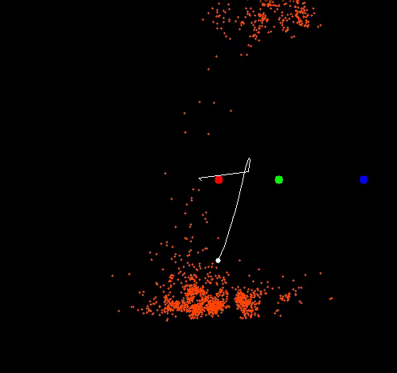

# Three-Points-Landmark-Based-SLAM
Implemented FastSLAM with three landmarks.
The position of the robot is updated by a particle filter, in which each particle has an extend Kalman filter for estimating landmarks' position.

# Prerequisites
1. CMake 
2. OpenCV (for visualization)
3. Eigen

# How to run
```
mkdir build  
cd build  
cmake ..  
make  
./runSLAM
```

# Simulation  
number of particles: 1500  
  
